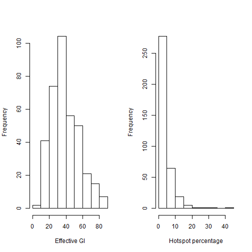
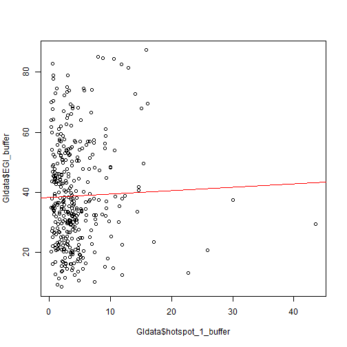
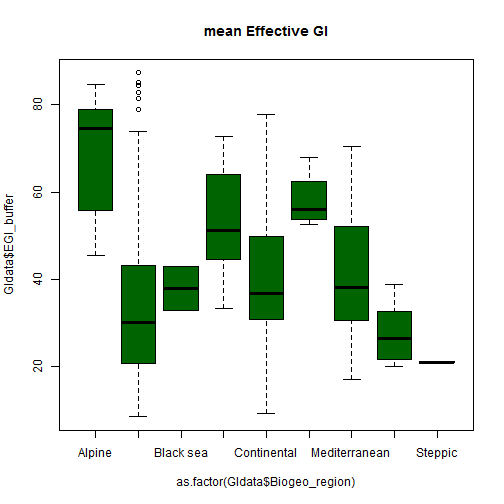

## A - What is R?
R is a **programming language** and a free **software environment** for statistical computing

R is an implementation of the S programming language -> a 'dialect' of S

R was created by **R**oss Ihaka and **R**obert Gentleman (University of Auckland, New Zealand) 

It is currently developed by the **R Development Core Team**.

The R language is widely used among **statisticians** and **data analysts** for developing statistical software and data analysis.


---
## B - Why R?
R is freely available under the GNU General Public License.

R provides a wide variety of statistical and graphical techniques, 
including:
* linear and nonlinear modeling, 
* classical statistical tests, 
* time-series analysis, 
* classification, 
* clustering, 
* and much more!!

---
## B - Why R?
When you download R, you are installing the 'base' R system
composed by:
* the base package, which contains most of fundamental functions. 
* other packages like utils, stats, datasets, graphics, grDevices, grid, methods, tools, parallel, compiler, splines, tcltk, stats4

But R is **easily extensible** through user-submitted packages for specific functions or specific areas of study.

Remember R is a collaborative project with a very **active** community of contributors. 

Most of these packages are stored in CRAN (Comprehensive R Archive Network) http://cran.r-project.org/mirrors.html

There are approximately 5600 packages on CRAN covering a wide range of topics.

Similarly, many biological libraries are compiled by the Bioconductor project 
http://www.bioconductor.org/


---
## B - Why R?
R runs on different platforms (windows, mac, linux, unix).

Another strength of R is static graphics, which can produce **publication-quality graphs**, including mathematical symbols.

Moreover, R facilitates **reproducible research** and automated **report generation.**

--- &radio
## Quizz 1
Select the right statement:

1. 1. R is a windows environment within which statistical techniques are implemented.
2. 2. R is a free statistical environment when user is commited to contribute at least one year with the project.
3. 3. R does not allow reproducible research.
4. _4. R provides a wide variety of statistical and graphical techniques, and is highly extensible._

***.hint 
R runs on different operating systems.
It is provided  as Free Software under the terms of the Free Software Foundation's GNU General Public License

---
## C - How?
R is presented in a command-line interface, but for a more user-friendly interface we are going to use RStudio Desktop.

The RStudio layout is divided in 4 panels:
* in the upper left corner: a source code editor 
* in the lower left corner: the R console
* in the upper right corner: the history and workspace tabs  
* in the lower right corner: Files, Plots, Packages and Help browser organised by different tabs


---
## C - How?
We are going to generate a new script where we will record every step of our analysis.

1. On the secondary menu, click on the green plus and select 'R script' (alternatively: Ctrl + Shift + N)
2. And now save it, we will give it the name 'ABC_to_R.r' and store it in the ABC_to_R folder
3. On the first lines, we will type:


```r
### ABC_to_R script to record the analysis performed in this seminar
### Author: Write here your name
### Date: XX-XX-XX
```

---
## C - How?
The most basic object is a **vector**.
A vector can only contain objects of the same class.

R has five **classes** of objects:
* character 
* numeric - double precision real numbers
* integer 
* complex
* logical - True / False

---
## C - How?

The c() combine function can be used to create vectors of objects, like:


```r
x1 <- c("a", "f", "z") ## character
x2 <- c(0.2,1.3, 0.9) ## numeric
x3 <- 1.25:3.25 ## numeric
x4 <- 3:5 ## integer
x5 <- c(3, 4, 5) ## integer
x6 <- c(TRUE, FALSE, FALSE) ## logical
x7 <- c(T, F, F) ## logical
x8 <- c(1+0i,3+4i) ## complex
```


```r
## Your turn to check it
class (x1)
class (x3)
class (x4)
class (x7)
class (x8)
```

---
## C - How?
Other useful functions are:

```r
length(x1) # number of elements or components
```

```
## [1] 3
```

```r
str(x1)    # structure of an object
```

```
##  chr [1:3] "a" "f" "z"
```

```r
names(x1)  # names
```

```
## NULL
```
---
## C - How?
Another way to generate vectors is using the vector () function


```r
x <- vector ("numeric", length = 3)
x
```

```
## [1] 0 0 0
```

```r
y <- 0:2 ## see the difference
y
```

```
## [1] 0 1 2
```

---
## C - How?
**Matrices** are vectors with a *dimension* attribute (nrow, ncol). 
All columns in a matrix must be of the same class (numeric, character, etc.) and the same length.

```r
m <- matrix (1:12, nrow=2, ncol=6)
m
```

```
##      [,1] [,2] [,3] [,4] [,5] [,6]
## [1,]    1    3    5    7    9   11
## [2,]    2    4    6    8   10   12
```

```r
dim (m)
```

```
## [1] 2 6
```

```r
attributes(m)
```

```
## $dim
## [1] 2 6
```

---
## C - How?
Selecting columns, rows, or different elements by the use of subscripts

```r
m[,4] # 4th column of matrix
```

```
## [1] 7 8
```

```r
m[2,] # 2nd row of matrix
```

```
## [1]  2  4  6  8 10 12
```

```r
m[1:2,4:5] # rows 1,2 of columns 4,5
```

```
##      [,1] [,2]
## [1,]    7    9
## [2,]    8   10
```

```r
m[1:2,c(4,6)] # rows 1,2 of columns 4,6
```

```
##      [,1] [,2]
## [1,]    7   11
## [2,]    8   12
```

---
## C - How?
Matrices can also be created by column-binding **cbind()** and row-binding **rbind()**

```r
m1 <- cbind (x,y)
m1
```

```
##      x y
## [1,] 0 0
## [2,] 0 1
## [3,] 0 2
```

```r
m2 <- rbind (x,y)
m2
```

```
##   [,1] [,2] [,3]
## x    0    0    0
## y    0    1    2
```

---
## C - How?
**Factors** are used to represent categorical data (like land use classes, biogeographic regions, size, etc.).
Factors are treated as integer vectors where each element has a label.

```r
sex <- factor(c('female', 'male', 'female', 'female', 'male'))
sex
```

```
## [1] female male   female female male  
## Levels: female male
```
Levels are the different categories present in the selected variable

```r
table(sex)
```

```
## sex
## female   male 
##      3      2
```

---
## C - How?
**Data frames** are used to store tabular data. 
* Data frames can store variables of different classes (each column can store different types of objects)
* Each variable must have the same number of elements (same number of rows)


```r
a <- 1:4
b <- c("apples", "lemons", "oranges", NA)
c <- c(T,F,F,T)
mydata <- data.frame(a,b,c)
mydata
```

```
##   a       b     c
## 1 1  apples  TRUE
## 2 2  lemons FALSE
## 3 3 oranges FALSE
## 4 4    <NA>  TRUE
```

```r
names(mydata) <- c("ID","Fruits","Available") 
```

---
## C - How?
Identifying elements in data frames:

```r
mydata[2:3] # columns 2,3 of data frame
```

```
##    Fruits Available
## 1  apples      TRUE
## 2  lemons     FALSE
## 3 oranges     FALSE
## 4    <NA>      TRUE
```

```r
mydata[c("ID","Available")] # columns ID and Available from data frame
```

```
##   ID Available
## 1  1      TRUE
## 2  2     FALSE
## 3  3     FALSE
## 4  4      TRUE
```

```r
mydata$Fruits # variable x1 in the data frame
```

```
## [1] apples  lemons  oranges <NA>   
## Levels: apples lemons oranges
```

---
## C - How?
Data frames can be created by data.frame() function. 
But are usually built by importing the data. This can be done by calling read.table() or read.csv() functions.

At this point, let's go back to our first script.

---
## C - How? 
We already have the header information. Now, it's time to start coding:

```r
# Check your working directory
getwd()
```

```
## [1] "C:/Users/Raquel/Documents/ABC_2_R/Reports/process/ABC_2_R"
```

```r
# If necessary, set your working directory
setwd("~/ABC_2_R")
```

```r
## Installing required packages
#install.packages('psych')

## http://cran.r-project.org/web/packages/psych/index.html
## A number of routines for personality, psychometrics and 
## experimental psychology. Functions are primarily for 
## scale construction using factor analysis, cluster 
## analysis and reliability analysis, although others 
## provide basic descriptive statistics.
```

---
## C - How? 

```r
## http://cran.r-project.org/web/packages/psych/index.html
## A number of routines for personality, psychometrics and 
## experimental psychology. Functions are primarily for 
## scale construction using factor analysis, cluster 
## analysis and reliability analysis, although others 
## provide basic descriptive statistics.
```

```r
## Loading required packages
library(psych)
```

```
## Warning: package 'psych' was built under R version 3.1.1
```

---
## C - How? 

```r
# Read data
setwd('C:/Users/Raquel/Documents/ABC_2_R')
GIdata <- read.csv ("./rawdata/FactSheet.csv", header = TRUE, sep = ";", dec =",")

# Describe and summary
describe (GIdata)
```

```
##                  vars   n      mean        sd    median   trimmed
## city_code*          1 370 1.855e+02 1.070e+02 1.855e+02 1.855e+02
## NAME_ASCI*          2 370 1.855e+02 1.070e+02 1.855e+02 1.855e+02
## NUTS3*              3 370 1.650e+02 9.044e+01 1.675e+02 1.662e+02
## Country*            4 370 1.493e+01 7.820e+00 1.400e+01 1.497e+01
## Biogeo_region*      5 370 4.200e+00 2.030e+00 5.000e+00 4.090e+00
## Coast_conection*    6 370 1.250e+00 4.300e-01 1.000e+00 1.180e+00
## Mean_altitude       7 369 1.633e+02 1.677e+02 1.110e+02 1.353e+02
## Pop_density         8 365 5.184e+04 1.373e+05 2.114e+03 2.046e+04
## area_m2             9 370 2.107e+08 2.535e+08 1.411e+08 1.628e+08
## area_km2           10 370 2.107e+02 2.535e+02 1.411e+02 1.628e+02
## perimeter_m        11 370 9.189e+04 5.492e+04 7.843e+04 8.331e+04
## edge_den_CC        12 370 2.060e+01 8.870e+00 2.023e+01 2.002e+01
## green_CC           13 370 2.568e+01 8.240e+00 2.410e+01 2.464e+01
## EGI_buffer         14 370 3.885e+01 1.697e+01 3.564e+01 3.759e+01
## hotspot_1_buffer   15 370 4.280e+00 4.270e+00 3.210e+00 3.540e+00
## final.class*       16 370 1.525e+01 6.760e+00 1.500e+01 1.483e+01
## Min                17 370 0.000e+00 0.000e+00 0.000e+00 0.000e+00
## X1Q                18 370 2.988e+01 2.117e+01 2.577e+01 2.783e+01
## Median             19 370 4.402e+01 2.055e+01 4.019e+01 4.269e+01
## Mean               20 370 3.885e+01 1.697e+01 3.564e+01 3.759e+01
## X3Q                21 370 5.245e+01 2.026e+01 4.988e+01 5.157e+01
## Max                22 370 6.134e+01 1.952e+01 5.991e+01 6.095e+01
##                        mad       min       max     range  skew kurtosis
## city_code*       1.371e+02 1.000e+00 3.700e+02 3.690e+02  0.00    -1.21
## NAME_ASCI*       1.371e+02 1.000e+00 3.700e+02 3.690e+02  0.00    -1.21
## NUTS3*           1.105e+02 1.000e+00 3.170e+02 3.160e+02 -0.08    -1.21
## Country*         1.038e+01 1.000e+00 2.600e+01 2.500e+01  0.04    -1.39
## Biogeo_region*   2.970e+00 1.000e+00 9.000e+00 8.000e+00  0.18    -1.15
## Coast_conection* 0.000e+00 1.000e+00 2.000e+00 1.000e+00  1.18    -0.62
## Mean_altitude    1.097e+02 0.000e+00 1.249e+03 1.249e+03  2.28     8.21
## Pop_density      1.956e+03 0.000e+00 1.639e+06 1.639e+06  5.98    54.58
## area_m2          9.564e+07 7.099e+06 2.248e+09 2.241e+09  4.30    24.01
## area_km2         9.564e+01 7.100e+00 2.248e+03 2.241e+03  4.30    24.01
## perimeter_m      3.466e+04 1.259e+04 3.449e+05 3.323e+05  2.05     5.33
## edge_den_CC      8.340e+00 4.310e+00 6.516e+01 6.085e+01  0.94     2.12
## green_CC         5.630e+00 1.000e+01 8.040e+01 7.040e+01  2.27     8.76
## EGI_buffer       1.716e+01 8.550e+00 8.733e+01 7.878e+01  0.61    -0.16
## hotspot_1_buffer 2.290e+00 3.500e-01 4.354e+01 4.319e+01  3.81    24.15
## final.class*     2.970e+00 1.000e+00 3.500e+01 3.400e+01  0.57     0.63
## Min              0.000e+00 0.000e+00 0.000e+00 0.000e+00   NaN      NaN
## X1Q              2.119e+01 0.000e+00 9.416e+01 9.416e+01  0.81     0.17
## Median           2.019e+01 0.000e+00 9.762e+01 9.762e+01  0.53    -0.26
## Mean             1.716e+01 8.540e+00 8.733e+01 7.878e+01  0.61    -0.16
## X3Q              2.234e+01 1.036e+01 9.895e+01 8.859e+01  0.33    -0.62
## Max              2.164e+01 1.465e+01 9.995e+01 8.530e+01  0.12    -0.78
##                         se
## city_code*       5.560e+00
## NAME_ASCI*       5.560e+00
## NUTS3*           4.700e+00
## Country*         4.100e-01
## Biogeo_region*   1.100e-01
## Coast_conection* 2.000e-02
## Mean_altitude    8.730e+00
## Pop_density      7.187e+03
## area_m2          1.318e+07
## area_km2         1.318e+01
## perimeter_m      2.855e+03
## edge_den_CC      4.600e-01
## green_CC         4.300e-01
## EGI_buffer       8.800e-01
## hotspot_1_buffer 2.200e-01
## final.class*     3.500e-01
## Min              0.000e+00
## X1Q              1.100e+00
## Median           1.070e+00
## Mean             8.800e-01
## X3Q              1.050e+00
## Max              1.010e+00
```

---
## C - How? 

```r
# Describe and summary
summary(GIdata)
```

```
##    city_code               NAME_ASCI       NUTS3        Country   
##  AT001  :  1   Aberdeen         :  1   ES300  :  9   UK     : 62  
##  AT002  :  1   Aix-en-Provence  :  1   ES511  :  5   DE     : 54  
##  AT003  :  1   Alba Iulia       :  1   PT114  :  5   PL     : 37  
##  AT004  :  1   Alcala de Henares:  1   UKD31  :  5   ES     : 33  
##  AT005  :  1   Alcobendas       :  1   UKC22  :  4   FR     : 30  
##  BE001  :  1   Alcorcon         :  1   UKD32  :  4   IT     : 27  
##  (Other):364   (Other)          :364   (Other):338   (Other):127  
##        Biogeo_region Coast_conection Mean_altitude   Pop_density     
##  Continental  :138   no :279         Min.   :   0   Min.   :      0  
##  Atlantic     :134   yes: 91         1st Qu.:  50   1st Qu.:   1063  
##  Mediterranean: 52                   Median : 111   Median :   2114  
##  Pannonian    : 15                   Mean   : 163   Mean   :  51841  
##  Boreal       : 14                   3rd Qu.: 236   3rd Qu.:   7260  
##  Alpine       :  9                   Max.   :1249   Max.   :1638580  
##  (Other)      :  8                   NA's   :1      NA's   :5        
##     area_m2            area_km2       perimeter_m      edge_den_CC   
##  Min.   :7.10e+06   Min.   :   7.1   Min.   : 12587   Min.   : 4.31  
##  1st Qu.:8.41e+07   1st Qu.:  84.1   1st Qu.: 57280   1st Qu.:14.31  
##  Median :1.41e+08   Median : 141.1   Median : 78430   Median :20.23  
##  Mean   :2.11e+08   Mean   : 210.7   Mean   : 91891   Mean   :20.60  
##  3rd Qu.:2.41e+08   3rd Qu.: 241.0   3rd Qu.:108291   3rd Qu.:25.30  
##  Max.   :2.25e+09   Max.   :2248.2   Max.   :344893   Max.   :65.16  
##                                                                      
##     green_CC      EGI_buffer    hotspot_1_buffer  final.class       Min   
##  Min.   :10.0   Min.   : 8.55   Min.   : 0.35    2_2_2_2:144   Min.   :0  
##  1st Qu.:20.7   1st Qu.:26.61   1st Qu.: 1.83    2_2_1_2: 30   1st Qu.:0  
##  Median :24.1   Median :35.65   Median : 3.21    2_2_3_2: 29   Median :0  
##  Mean   :25.7   Mean   :38.85   Mean   : 4.28    1_2_2_2: 23   Mean   :0  
##  3rd Qu.:28.3   3rd Qu.:50.13   3rd Qu.: 5.02    2_3_2_2: 13   3rd Qu.:0  
##  Max.   :80.4   Max.   :87.33   Max.   :43.54    2_1_2_2: 12   Max.   :0  
##                                                  (Other):119              
##       X1Q           Median          Mean            X3Q      
##  Min.   : 0.0   Min.   : 0.0   Min.   : 8.54   Min.   :10.4  
##  1st Qu.:13.4   1st Qu.:28.6   1st Qu.:26.61   1st Qu.:36.8  
##  Median :25.8   Median :40.2   Median :35.65   Median :49.9  
##  Mean   :29.9   Mean   :44.0   Mean   :38.85   Mean   :52.5  
##  3rd Qu.:43.7   3rd Qu.:56.7   3rd Qu.:50.13   3rd Qu.:66.4  
##  Max.   :94.2   Max.   :97.6   Max.   :87.33   Max.   :99.0  
##                                                              
##       Max       
##  Min.   : 14.6  
##  1st Qu.: 45.5  
##  Median : 59.9  
##  Mean   : 61.3  
##  3rd Qu.: 74.6  
##  Max.   :100.0  
## 
```

---
## C - How? 

```r
# Histograms
par(mfrow=c(1,2))
hist(GIdata$EGI_buffer, xlab ="Effective GI", main="")
hist(GIdata$hotspot_1_buffer, xlab ="Hotspot percentage", main="")
```

 

---
## C - How? 

```r
# Correlation matrix for GI values
sel_var <- GIdata[, c(5:9,14:15)]
round (cor(sel_var[5:7]),2)
```

```
##                  area_m2 EGI_buffer hotspot_1_buffer
## area_m2             1.00      -0.05            -0.16
## EGI_buffer         -0.05       1.00             0.03
## hotspot_1_buffer   -0.16       0.03             1.00
```

---
## C - How? 

```r
# Scatterplots and regression lines
# For Mean Effective GI
plot (GIdata$EGI_buffer~GIdata$hotspot_1_buffer)
abline (lm(GIdata$EGI_buffer~GIdata$hotspot_1_buffer), col="red")
```

 

---
## C - How? 

```r
# Boxplots
plot (GIdata$EGI_buffer~as.factor(GIdata$Biogeo_region), col="darkgreen", main ="mean Effective GI")
```

 

```r
unique(GIdata$Biogeo_region)
```

```
## [1] Continental   Alpine        Atlantic      Black sea     Mediterranean
## [6] Boreal        Macaronesia   Pannonian     Steppic      
## 9 Levels: Alpine Atlantic Black sea Boreal Continental ... Steppic
```

---
## C - How? 

```r
# linear models
lmEGI <- lm (GIdata$EGI_buffer ~ GIdata$Pop_density + GIdata$area_km2 + GIdata$hotspot_1_buffer)
```

---
## C - How? 

```r
# linear models
summary (lmEGI)
```

```
## 
## Call:
## lm(formula = GIdata$EGI_buffer ~ GIdata$Pop_density + GIdata$area_km2 + 
##     GIdata$hotspot_1_buffer)
## 
## Residuals:
##    Min     1Q Median     3Q    Max 
## -32.05 -11.92  -3.02  11.76  44.00 
## 
## Coefficients:
##                          Estimate Std. Error t value Pr(>|t|)    
## (Intercept)              4.05e+01   1.56e+00   25.94  < 2e-16 ***
## GIdata$Pop_density      -2.32e-05   6.59e-06   -3.52  0.00049 ***
## GIdata$area_km2         -5.27e-03   3.55e-03   -1.48  0.13845    
## GIdata$hotspot_1_buffer  1.87e-01   2.10e-01    0.89  0.37235    
## ---
## Signif. codes:  0 '***' 0.001 '**' 0.01 '*' 0.05 '.' 0.1 ' ' 1
## 
## Residual standard error: 16.8 on 361 degrees of freedom
##   (5 observations deleted due to missingness)
## Multiple R-squared:  0.0362,	Adjusted R-squared:  0.0282 
## F-statistic: 4.52 on 3 and 361 DF,  p-value: 0.004
```

---
## C - How? 

```r
lmHS <- lm (GIdata$hotspot_1_buffer ~ GIdata$Mean_altitude + GIdata$Pop_density + GIdata$area_km2)
```

---
## C - How? 

```r
summary (lmHS)
```

```
## 
## Call:
## lm(formula = GIdata$hotspot_1_buffer ~ GIdata$Mean_altitude + 
##     GIdata$Pop_density + GIdata$area_km2)
## 
## Residuals:
##    Min     1Q Median     3Q    Max 
##  -4.34  -2.28  -0.95   0.82  38.58 
## 
## Coefficients:
##                       Estimate Std. Error t value Pr(>|t|)    
## (Intercept)           5.28e+00   3.67e-01   14.39  < 2e-16 ***
## GIdata$Mean_altitude -5.13e-03   1.28e-03   -4.00  7.6e-05 ***
## GIdata$Pop_density    4.41e-06   1.59e-06    2.77   0.0059 ** 
## GIdata$area_km2      -2.15e-03   8.57e-04   -2.51   0.0127 *  
## ---
## Signif. codes:  0 '***' 0.001 '**' 0.01 '*' 0.05 '.' 0.1 ' ' 1
## 
## Residual standard error: 4.1 on 360 degrees of freedom
##   (6 observations deleted due to missingness)
## Multiple R-squared:  0.0804,	Adjusted R-squared:  0.0728 
## F-statistic: 10.5 on 3 and 360 DF,  p-value: 1.23e-06
```
